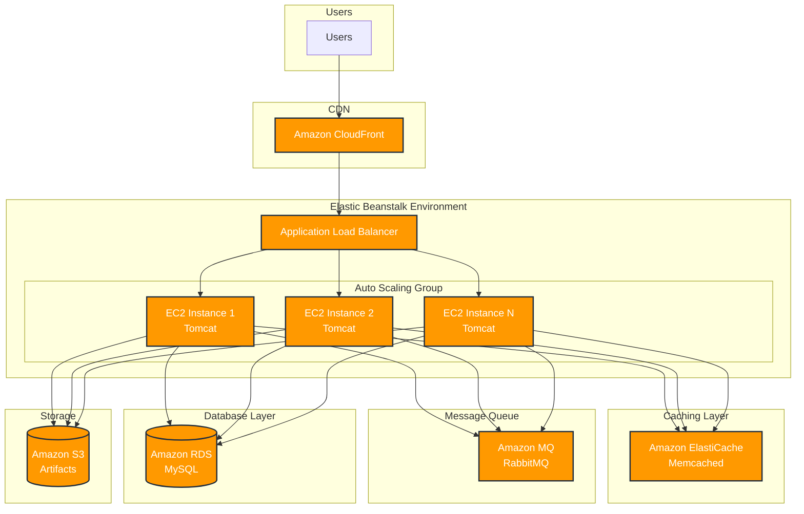

# Java Application AWS PaaS Deployment

A scalable and secure deployment architecture for Java applications using AWS Platform as a Service (PaaS) solutions. This project implements a robust cloud infrastructure leveraging various AWS services for optimal performance, security, and reliability.

## Architecture Overview

The application follows a modern cloud-native architecture leveraging various AWS services:



Key components:
1. **Content Delivery**:
   - CloudFront CDN for global content delivery
   - Reduced latency and improved user experience

2. **Application Layer**:
   - Elastic Beanstalk managing auto-scaling EC2 instances
   - Application Load Balancer for traffic distribution
   - Multiple Tomcat servers running the Java application

3. **Caching Layer**:
   - ElastiCache (Memcached) for in-memory caching
   - Reduced database load and improved response times

4. **Message Queue**:
   - Amazon MQ (RabbitMQ) for service-to-service communication
   - Asynchronous processing and decoupled architecture

5. **Data Layer**:
   - Amazon RDS (MySQL) for persistent storage
   - S3 for storing deployment artifacts

## Tech Stack

### AWS Services
- **AWS Elastic Beanstalk**: Application environment and auto-scaling management
- **Amazon MQ (RabbitMQ)**: Service-to-service messaging
- **Amazon ElastiCache (Memcached)**: In-memory caching
- **Amazon RDS (MySQL)**: Primary database
- **Amazon S3**: Deployment artifact storage
- **Amazon CloudFront**: Content delivery network
- **Application Load Balancer**: Traffic distribution
- **Auto Scaling Groups**: Dynamic capacity management

### Application
- Java
- Maven
- Tomcat
- MySQL

## Prerequisites

- AWS Account with appropriate permissions
- AWS CLI installed and configured
- Java Development Kit (JDK)
- Maven
- MySQL Client

## Setup Instructions

### 1. Security Configuration
```bash
# Create security groups for backend services
aws ec2 create-security-group --group-name backend-services --description "Security group for backend services"

# Create key pair for EC2 access
aws ec2 create-key-pair --key-name application-key
```

### 2. Database Setup
1. Create RDS instance in private subnet
2. Configure database using temporary EC2 instance:
   ```bash
   mysql -h <rds-endpoint> -P 3306 -u admin -p
   ```
3. Update application.properties with database credentials

### 3. Application Build
```bash
mvn clean install
```

### 4. Elastic Beanstalk Deployment
1. Create new Elastic Beanstalk application
2. Upload the generated WAR file
3. Configure environment variables
4. Set up auto-scaling rules

### 5. CloudFront Setup
1. Create distribution
2. Point to Elastic Beanstalk ALB
3. Configure caching rules

### 6. Caching and Messaging
1. Create ElastiCache cluster
2. Set up Amazon MQ broker
3. Configure application to use caching and messaging services

## Environment Variables

```properties
# Database
DB_HOST=<rds-endpoint>
DB_NAME=<database-name>
DB_USER=<database-user>
DB_PASSWORD=<database-password>

# RabbitMQ
RABBITMQ_HOST=<mq-endpoint>
RABBITMQ_USER=<mq-user>
RABBITMQ_PASSWORD=<mq-password>

# Cache
CACHE_ENDPOINT=<elasticache-endpoint>
CACHE_PORT=11211
```

## Deployment

1. Build the application:
   ```bash
   mvn clean package
   ```

2. Deploy to Elastic Beanstalk:
   ```bash
   eb deploy
   ```

## Monitoring and Maintenance

- Use CloudWatch for monitoring metrics
- Set up CloudWatch alarms for critical thresholds
- Regular backup verification for RDS
- Monitor ElastiCache hit rates
- Check RabbitMQ queue depths

## Security Considerations

- All backend services are in private subnets
- Security groups restrict access between services
- SSL/TLS encryption for data in transit
- Regular security patches and updates
- AWS WAF integration for web security

## Scaling

The application scales automatically based on:
- CPU utilization
- Memory usage
- Network traffic
- Request count

## Contributing

1. Fork the repository
2. Create your feature branch (`git checkout -b feature/AmazingFeature`)
3. Commit your changes (`git commit -m 'Add some AmazingFeature'`)
4. Push to the branch (`git push origin feature/AmazingFeature`)
5. Open a Pull Request

## License

This project is licensed under the MIT License - see the [LICENSE.md](LICENSE.md) file for details.

## Contact

Shayan Nazar - [GitHub Profile](https://github.com/shyrradev)


